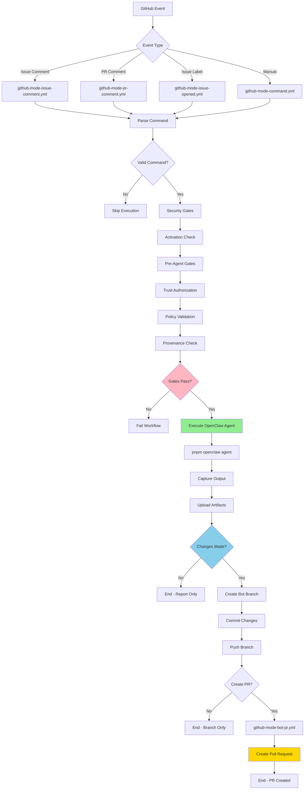
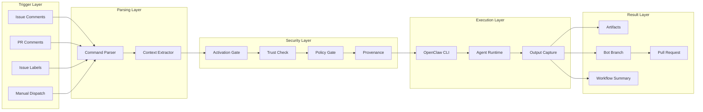
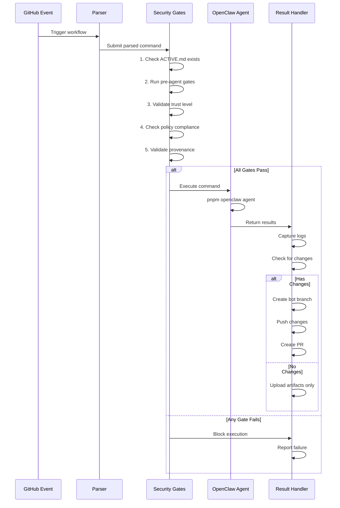
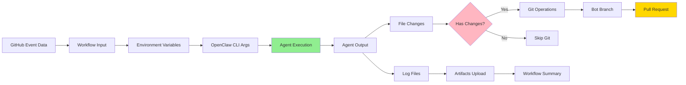

# GitHub Mode Architecture

## System Overview

GitHub Mode enables OpenClaw agents to execute in response to GitHub repository events, providing AI-powered code analysis, refactoring, testing, and review capabilities directly within your GitHub workflow.

## Event Flow Diagram



## Component Architecture



## Security Gates Flow



## Data Flow



## Command Translation

| User Input                  | Command Type | Agent Message Template                       | Expected Output       |
| --------------------------- | ------------ | -------------------------------------------- | --------------------- |
| `/openclaw explain <file>`  | `explain`    | "Explain the code in {file}..."              | Analysis in artifacts |
| `/openclaw refactor <file>` | `refactor`   | "Analyze {file} and suggest improvements..." | Code changes + PR     |
| `/openclaw test <file>`     | `test`       | "Review {file} and create tests..."          | Test files + PR       |
| `/openclaw diagram <file>`  | `diagram`    | "Create diagram of {file}..."                | Documentation + PR    |
| `/openclaw review` (on PR)  | `review`     | "Review PR #{number} changes..."             | Analysis + PR         |

## Artifact Storage

```
Workflow Run
├── github-mode-command-output/
│   └── agent-log.txt                 # Full agent output
├── github-mode-command-dispatch/
│   └── evidence.json                 # Execution metadata
├── github-mode-command-auth/
│   └── authorization-decision.json   # Trust check results
├── github-mode-command-policy-gate/
│   └── policy-decision.json          # Policy validation
└── github-mode-command-provenance/
    └── provenance-validation.json    # Audit trail
```

Retention: 90 days for all artifacts

## State Management

**Current (Stateless):**

- Each workflow run starts fresh
- No memory between runs
- Suitable for: one-shot commands, code review, analysis

**Future (Optional):**

- External storage for agent memory
- Checkpoint/restore for long tasks
- Cross-run context persistence

## Performance Considerations

- **Startup**: ~30-60s (install dependencies + build)
- **Agent Execution**: Varies by task (1-5 minutes typical)
- **Artifacts Upload**: ~5-10s
- **PR Creation**: ~10-20s

Total typical run time: **2-7 minutes**

## Scalability

- GitHub Actions concurrency limits apply
- Multiple workflows can run in parallel
- Each workflow is isolated
- Artifacts stored per-run, no shared state

## Security Boundaries

```
┌─────────────────────────────────────┐
│  Untrusted Context                  │
│  - Fork PRs                         │
│  - Public comments                  │
│  └─> Read-only access               │
│      No secret exposure             │
└─────────────────────────────────────┘
                 │
                 ▼
         [Trust Gate]
                 │
                 ▼
┌─────────────────────────────────────┐
│  Trusted Context                    │
│  - Repository members               │
│  - Internal PRs                     │
│  └─> Write access                   │
│      Can create branches/PRs        │
│      Policy-gated operations        │
└─────────────────────────────────────┘
```

## Failure Modes

| Scenario             | Detection         | Recovery                |
| -------------------- | ----------------- | ----------------------- |
| Agent timeout        | Workflow timeout  | Captured in logs        |
| No file changes      | git diff check    | Skip PR creation        |
| Gate failure         | Script exit code  | Block execution         |
| Invalid command      | Parser regex      | Skip execution          |
| Missing dependencies | pnpm install fail | Workflow fails          |
| Rate limits          | GitHub API        | Auto-retry with backoff |

## Monitoring Points

1. **Workflow Success Rate**: Actions → Workflows → Success %
2. **Average Runtime**: Check workflow duration trends
3. **Artifact Size**: Monitor storage usage
4. **PR Creation Rate**: Track bot PR frequency
5. **Gate Failures**: Review security gate logs

## Configuration Points

| Location                 | Purpose              | Example                |
| ------------------------ | -------------------- | ---------------------- |
| `.GITHUB-MODE/ACTIVE.md` | Master on/off switch | Rename to disable      |
| `.GITHUB-MODE/runtime/`  | Policy contracts     | Edit trust-levels.json |
| Workflow inputs          | Command options      | Add new commands       |
| Message templates        | Agent prompts        | Customize in workflow  |

## Integration Points

GitHub Mode can be called from other workflows:

```yaml
jobs:
  custom-check:
    uses: ./.github/workflows/github-mode-command.yml
    with:
      command: refactor
      target: src/changed-file.ts
      open_bot_pr: true
```

## Observability

**Workflow Summary includes:**

- Command details
- Gate results (✅ or ❌)
- Last 100 lines of agent output
- Bot PR link (if created)

**Artifacts contain:**

- Complete agent logs
- All gate decision records
- Execution metadata
- Provenance audit trail
